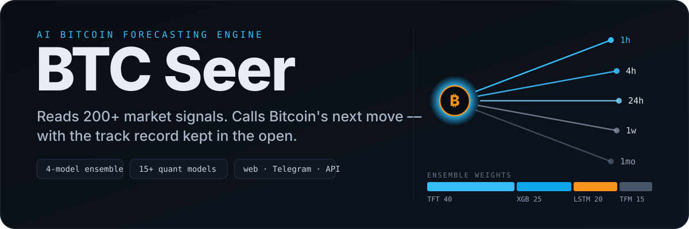
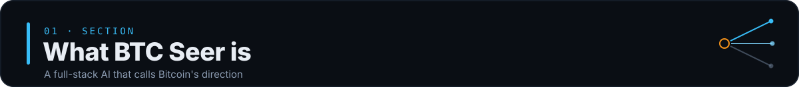
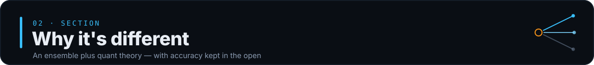
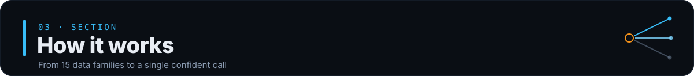
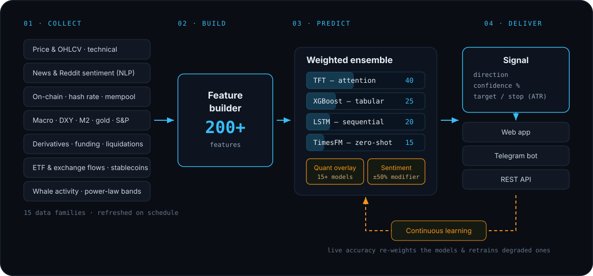
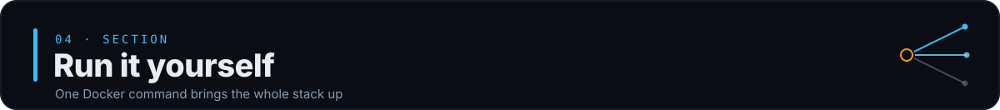

<p align="center">
  
</p>

<p align="center">
  <a href="#run-it-yourself"><b>Run it</b></a> ·
  <a href="#how-it-works"><b>How it works</b></a> ·
  <a href="#surfaces">Surfaces</a> ·
  <a href="#the-stack">Stack</a> ·
  <a href="#honest-limits">Limits</a>
</p>

<p align="center">
  
  
  
  
</p>

---

<p align="center">
  
</p>

<p align="center"><i>BTC Seer reads the market the way an oracle reads omens — many signals at once, one call at the end.</i></p>

---

<p align="center">
  
</p>

**BTC Seer** is a full-stack system that predicts **which way Bitcoin moves next** — over the next hour, four hours, day, week, and month — and shows its working instead of hiding it.

It does not promise riches. It ingests a wide slice of the market (price, order-flow, on-chain, macro, sentiment, derivatives, ETF and exchange flows, whale activity), compresses it into a **200+ feature vector**, runs that through a **four-model machine-learning ensemble** plus a **15+ model quant-theory overlay**, and emits a directional call with a confidence score and ATR-based target/stop.

Every prediction is stored and scored against what actually happened, so the track record is auditable — not cherry-picked screenshots.

> **Not financial advice.** Predictions are ML-generated and can be wrong. Past accuracy does not guarantee future results.

---

<p align="center">
  
</p>

- **No single model gets to be right alone.** A Temporal Fusion Transformer, an LSTM, XGBoost, and the TimesFM foundation model each vote; their weights (`TFT 40 / XGBoost 25 / LSTM 20 / TimesFM 15`) are the *starting* point, not the final word.
- **ML meets classic theory.** A separate quant engine scores 15+ well-known Bitcoin methods — Pi Cycle Top, Mayer Multiple, halving-cycle position, mean-reversion Z-score, DXY and M2 correlation, funding-rate extremes, NVT, power-law bands, and more — and overlays that signal on the ensemble.
- **It learns from being wrong.** A continuous-learning loop tracks each model's rolling accuracy, re-weights the ensemble toward whatever is currently working, and selectively retrains models that have degraded.
- **Confidence decays with distance.** A 1-hour call is treated as far more reliable than a 1-month one — the horizons carry different weight by design.
- **Accuracy is a first-class feature.** Predictions are logged and graded automatically; the app surfaces the real hit rate rather than a marketing number.

---

<p align="center">
  
</p>
<a id="how-it-works"></a>

<p align="center">
  
</p>

1. **Collect** — schedulers pull from ~15 data families: exchange OHLCV, news and Reddit sentiment (NLP), on-chain metrics, macro (DXY, M2, gold, S&P), derivatives and funding, liquidations, ETF and exchange flows, stablecoins, whale wallets, and power-law bands.
2. **Build** — the `FeatureBuilder` assembles everything into a single 200+ dimension feature vector.
3. **Predict** — the ensemble produces a call per horizon; a `±50%` sentiment modifier and the quant-theory score adjust it; horizon confidence decays from `1h` outward.
4. **Deliver** — the `SignalGenerator` converts the prediction into an actionable signal — direction, confidence, and ATR-based targets and stops — then serves it to every surface.

<a id="surfaces"></a>

### Surfaces

| Surface | What you get |
| --- | --- |
| **Web app** (React) | Dashboard, prediction cards, technical/on-chain/macro panels, accuracy tracker, Elliott Wave, power-law, whales, liquidations, mock trading |
| **Telegram bot** (aiogram) | `/predict`, `/signal`, `/news`, `/accuracy`, `/advisor`, alerts, referrals — a Telegram Mini-App front end |
| **REST API** (FastAPI) | Programmatic access to predictions, signals, market data, and charts |

---

<p align="center">
  
</p>
<a id="run-it-yourself"></a>

The whole stack — Python backend, ML ensemble, and the built React front end — ships as one Docker image.

```bash
git clone https://github.com/xidik12/btc-seer.git
cd btc-seer

# 1. Configure — copy the example and fill in what you have
cp .env.example .env
#   Minimum useful setup: TELEGRAM_BOT_TOKEN (for the bot).
#   Most data collectors run on free public endpoints; API keys are optional.
#   DATABASE_URL defaults to local SQLite; Postgres is auto-wired on Railway.

# 2. Bring it up
docker compose up --build
```

The API and web app come up on **`http://localhost:8000`** (health check at `/health`). Predictions warm up as the schedulers collect their first data.

<details>
<summary><b>Run the backend directly (without Docker)</b></summary>

```bash
cd backend
pip install torch==2.5.1 --index-url https://download.pytorch.org/whl/cpu
pip install -r requirements.txt
uvicorn app.main:app --reload --port 8000
```

Build the front end separately with `cd webapp && npm ci && npm run build`.
</details>

<details>
<summary><b>Train the models (optional)</b></summary>

Out of the box the ensemble runs in a **heuristic mode** (XGBoost-heavy, TimesFM zero-shot) so it works before any training. To train the real models and produce weights under `backend/app/models/weights/`:

```bash
cd backend
python ml/train_xgboost.py
python ml/train_lstm.py
python ml/backtest.py     # evaluate on historical data
```
</details>

---

<a id="the-stack"></a>

## The stack

| Layer | Tech |
| --- | --- |
| **API** | FastAPI · Uvicorn/Gunicorn · WebSockets |
| **ML** | PyTorch · pytorch-forecasting (TFT) · XGBoost · scikit-learn · TimesFM · ARCH/GARCH · PyWavelets |
| **Data / NLP** | pandas · numpy · `ta` · VADER + Transformers sentiment · ccxt · yfinance · feedparser |
| **Storage** | SQLAlchemy (async) · SQLite (dev) / PostgreSQL (prod) · Alembic · Redis cache |
| **Front end** | React 18 · Vite · Tailwind · Recharts · i18n (EN/RU/ZH) |
| **Bot** | aiogram 3 · Telegram Mini-App + Stars subscriptions |
| **Ops** | Docker · Railway · Sentry · Prometheus · n8n growth automations |

---

<a id="honest-limits"></a>

## Honest limits

- **This is a forecasting tool, not a guarantee.** Markets are adversarial and regime-shifting; any model can and will be wrong. Nothing here is financial advice.
- **No accuracy figure is claimed in this README on purpose.** The app tracks and displays its own live accuracy — trust the running number, not a static badge.
- **Quality scales with data access.** Free public endpoints work, but some collectors improve with optional API keys (CryptoPanic, Reddit, FRED, Etherscan, CoinGecko).
- **Untrained ensemble is a baseline.** Without trained weights the system falls back to heuristics; train the models for its intended behavior.

## Repository layout

```text
backend/     FastAPI app — api/ collectors/ features/ models/ signals/ advisor/ bot/ scheduler/
webapp/      React + Vite front end (Telegram Mini-App)
n8n/         Growth-automation workflows
docs/        Marketing playbook
RESEARCH_BTC_MODELS.md   Research behind the quant-theory engine
```

## License

See the repository for license terms.
